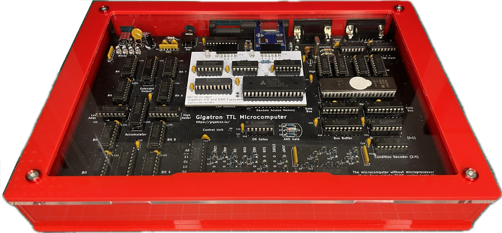
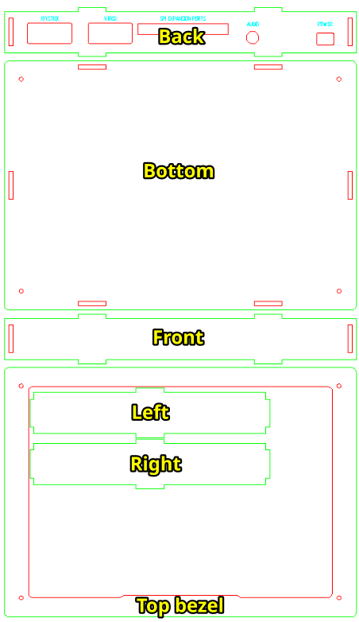
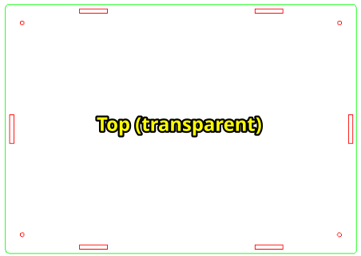
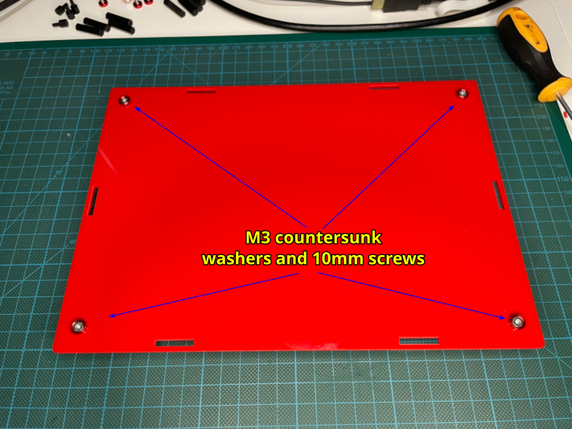
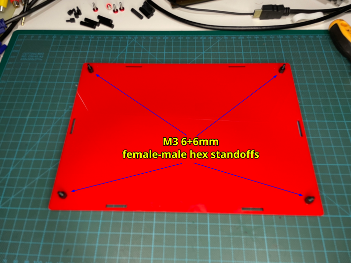
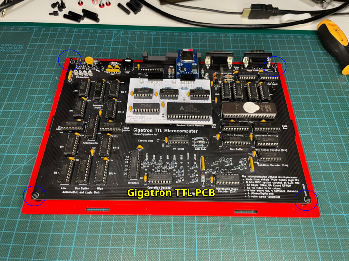
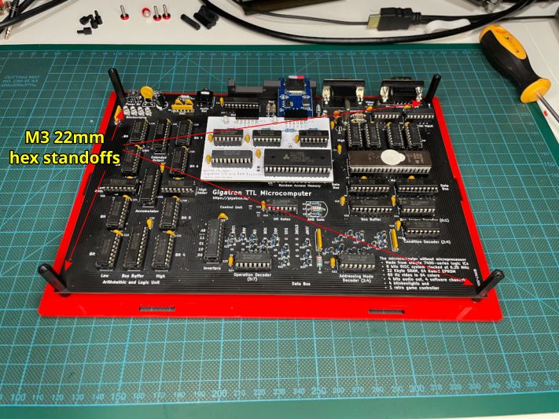
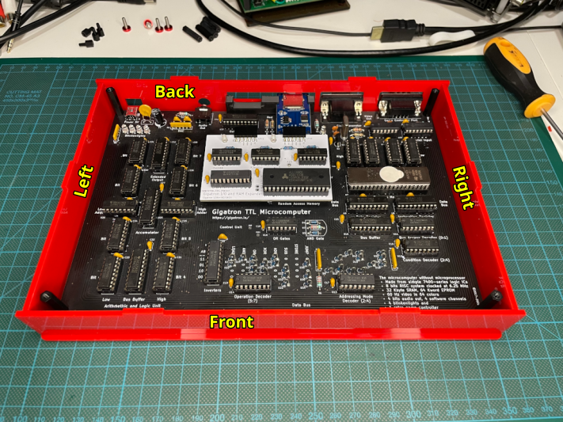
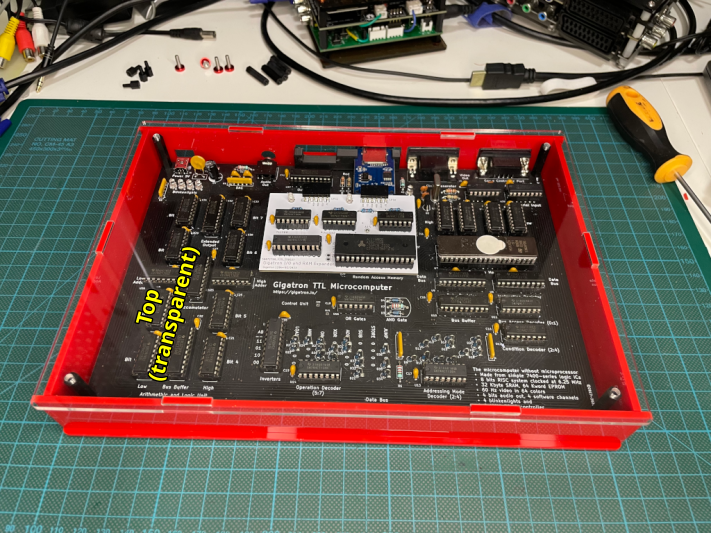
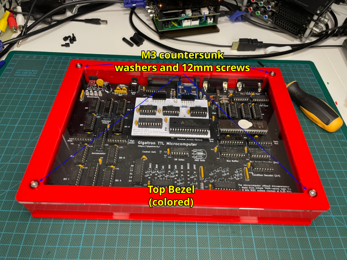

# Acrylic Enclosure for the Gigatron TTL microcomputer

## introduction

The [Gigatron TTL microcomputer](https://gigatron.io/) by Marcel van Kervinck and Walter Belgers is a minimalistic retro computer without a microprocessor chip.

The original Gigatron TTL microcomputer was sold as a kit with a wooden enclosure, but that original enclosure is no longer available anymore.

This acrylic enclosure has been designed to replace the original wooden enclosure while keeping its overall look and feel.

## Features

* Transparent top layer to expose the Gigatron TTL microcomputer
* Open holes for all original Gigatron TTL connectors (power, audio, video, joystick)
* Compatible with the [Gigatron I/O and RAM expander](https://hackaday.io/project/164176-gigatron-io-and-ram-expander), specifically tested with [hans61 Dual Drive 128K Expansion](https://github.com/hans61/Gigatron-TTL/tree/main/Expansion128k)
* Only 4 screws needed to open and get access to the Gigatron TTL microcomputer

## [Enclosure](enclosure/)

The enclosure is designed for 3mm acrylic sheets and must be cut by laser for optimal results.

There is a set of colored pieces (`Bottom`, `Left`, `Right`, `Front`, `Back` and `Top bezel`) and one transparent piece (`Top (transparent)`).

* [gigatron-ttl-acrylic-case-v1b-3mm-438x254-red-ready-to-lasercut.dxf](enclosure/gigatron-ttl-acrylic-case-v1b-3mm-438x254-red-ready-to-lasercut.dxf)
* [gigatron-ttl-acrylic-case-v1b-3mm-dina4-transparent-ready-to-lasercut.dxf](enclosure/gigatron-ttl-acrylic-case-v1b-3mm-dina4-transparent-ready-to-lasercut.dxf)

## Building the enclosure

### Required material

* 3mm colored acrylic sheet (at least 438mm x 254mm)
* 3mm DINA4 transparent acrylic sheet
* 4x 6+6mm M3 female-male hex standoffs
* 4x 22mm M3 female-female hex standoffs
* 8x M3 aluminum washer for countersunk screws
* 4x 10mm M3 countersunk screws
* 4x 12mm M3 countersunk screws

### Assembly instructions

1. Use the provided [CAD design files](enclosure/) to have the acrylic sheets cut by laser into the required parts.

2. Peel the plastic protections from all the acrylic parts.

3. Start by inserting four M3 10mm countersunk screws with their respective washers spacers on the `Bottom` part from the outside to the inside. Add a bit of bluetak or tape to secure the screws on the outside as you will need now to turn the `Bottom` part upside down.

4. Turn the `Bottom`part so that the interior side now looks upwards, and screw on the inside the four M3 6+6mm female-male hex standoffs to the M3 10mm countersunk screws that you just inserted.

5. Slide in the Gigatron TTL microcomputer PCB aligning the PCB holes with the male side of the M3 6+6mm hex standoffs.

6. Screw the four M3 22mm hex female standoffs on top of the Gigatron TTL microcomputer PCB to the male side of the M3 6+6mm hex standoffs.

7. Add the `Back`, `Left`, `Right`and `Front` parts of the enclosure, snapping them to the `Bottom` part and between them.

8. Insert the `Top (transparent)` part into the already formed enclosure. Do not use screws yet.

9. Finally, add the `Top bezel` part on top of the `Top (transparent)` part and align their holes (both parts) to the M3 22mm hex female standoff holes. Use the remaining washers and 12mm screws to securely close the enclosure.

